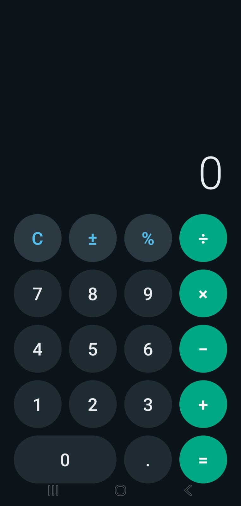
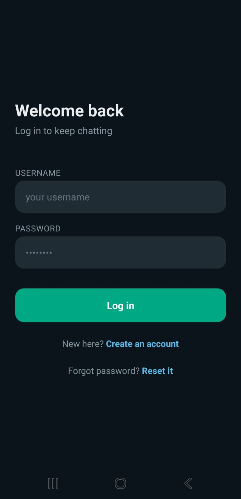
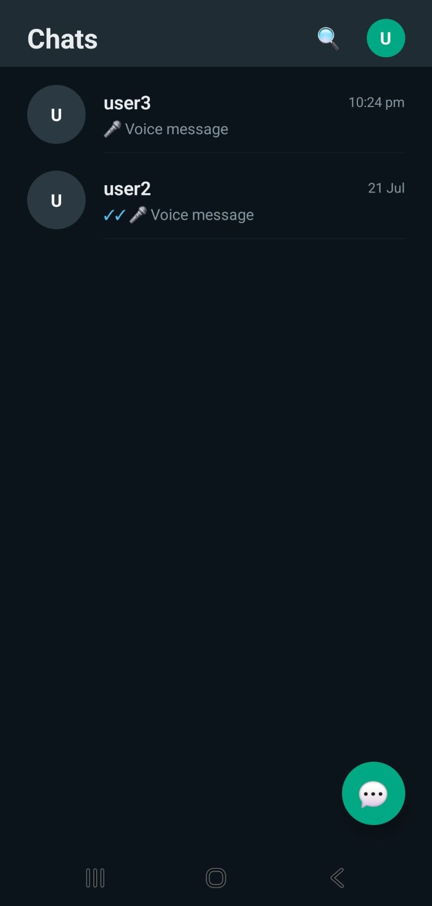
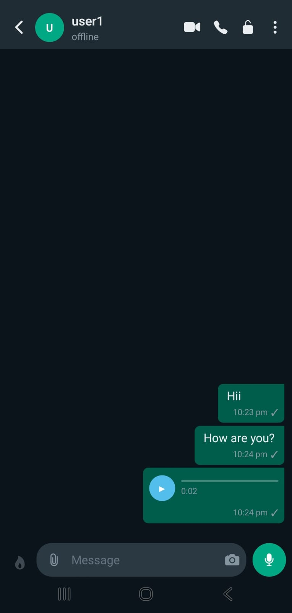
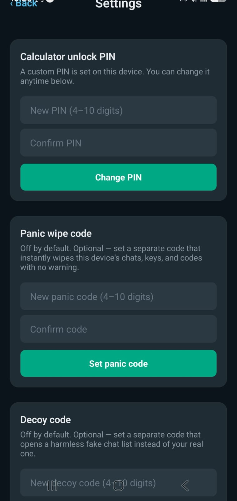

<div align="center">

# 🔐 Secret Chat

**A privacy-first, end-to-end encrypted chat app that hides in plain sight as a calculator.**


</div>

---

## ✨ Overview

**Secret Chat** looks like an ordinary calculator. Type your secret unlock code and press `=`, and the real chat app opens. Type a *decoy* code and a fake, harmless chat list opens instead. Type the *panic* code and all local data is wiped instantly.

Messages are encrypted on the device with **NaCl (`tweetnacl`) public-key cryptography**, so the server only ever stores ciphertext.

The monorepo has three parts: a **mobile app**, a **realtime backend**, and a **super-admin web panel**.

## 📸 Screenshots

### 📱 Mobile app

| Calculator (disguise) | Login | Chat list |
|:---:|:---:|:---:|
|  |  |  |

| 1-to-1 chat |
|:---:|:---:|:---:|
|  |

| Decoy chat list |
|:---:|:---:|:---:|
| |  |


## 🚀 Features

### 🕵️ Stealth & security
- **Calculator disguise**: a fully working calculator is the app's front door
- **Three secret codes**: *unlock* (real app), *decoy* (fake chats), *panic* (wipe local data)
- **End-to-end encryption** using `tweetnacl` key pairs; private keys live in the device's secure storage (`expo-secure-store`)
- **Screenshot detection** that notifies the other person
- **View-once messages** that cannot be opened twice
- **Recovery code** to reset a forgotten password without an email or phone number
- **Rate limiting** on auth, uploads and pairing attempts

### 💬 Messaging
- Realtime 1-to-1 and **group chats** over Socket.IO
- Typing indicators, delivered/seen receipts, online status
- Emoji reactions and delete-for-everyone
- Image and **voice messages** (Cloudinary storage)
- Push notifications (Expo Notifications)

### 📞 Calls
- Voice and video calls using **WebRTC** with TURN relay support

### 🤝 Private pairing
- Contacts are added by a **one-time pairing code**, with no public user search
- Optional **exclusive lock** between two people, which both must confirm

### 🛡️ Super-admin panel
- Platform stats, user list, **ban / unban / delete** users
- Protected by JWT and a `superadmin` role check

## 🧱 Architecture

```
┌──────────────────┐   REST + Socket.IO   ┌──────────────────┐     ┌───────────┐
│  Mobile (Expo)   │ ───────────────────▶ │ Backend (Express)│ ──▶ │  MongoDB  │
│  E2E encrypt/    │ ◀─────────────────── │  + Socket.IO     │ ──▶ │ Cloudinary│
│  decrypt here    │                      └──────────────────┘     └───────────┘
└────────┬─────────┘                               ▲
         │ WebRTC (P2P / TURN)                     │ REST
         ▼                                ┌──────────────────┐
   other device                           │ Admin (React+Vite)│
                                          └──────────────────┘
```

## 📁 Project Structure

```
secret-app/
├── mobile/            # Expo / React Native app
│   └── src/
│       ├── screens/       # Calculator, Chat, Group, Profile, Decoy ...
│       ├── components/    # MessageBubble, CallOverlay, VoiceMessagePlayer
│       ├── context/       # Auth, AppLock, Call
│       ├── crypto/        # e2e.js (NaCl box encrypt/decrypt)
│       └── services/      # api, socket, keys, secretCodes, notifications
├── backend/           # Node.js + Express + Socket.IO API
│   ├── controllers/   routes/   models/   middleware/
│   ├── socket/        # realtime events
│   └── seed/          # super-admin creation script
└── admin-panel/       # React + Vite dashboard
```

## 🛠️ Tech Stack

| Layer | Technology |
|---|---|
| Mobile | React Native 0.81, Expo SDK 54, React Navigation, `react-native-webrtc` |
| Crypto | `tweetnacl`, `expo-crypto`, `expo-secure-store` |
| Backend | Node.js, Express 5, Socket.IO, Mongoose, JWT, bcryptjs, Multer |
| Storage | MongoDB, Cloudinary |
| Admin | React 19, Vite, React Router, Axios |

## ⚙️ Getting Started

**Prerequisites:** Node.js 18+, a MongoDB database, a Cloudinary account, and the Expo toolchain. Note that `react-native-webrtc` needs a **development build**, so Expo Go will not work for calls.

### 1. Clone
```bash
git clone https://github.com/<your-username>/secret-app.git
cd secret-app
```

### 2. Backend
```bash
cd backend
npm install
cp .env.example .env      # then fill in your values
npm run seed:admin        # creates the super-admin
npm run dev               # http://localhost:5000
```

### 3. Admin panel
```bash
cd admin-panel
npm install
cp .env.example .env
npm run dev
```

### 4. Mobile app
```bash
cd mobile
npm install
cp .env.example .env
npx expo start
# for a dev build with WebRTC:
npx expo run:android
```

## 🔑 Environment Variables

| Where | Variable | Purpose |
|---|---|---|
| backend | `PORT` | Server port (default 5000) |
| backend | `MONGO_URI` | MongoDB connection string |
| backend | `JWT_SECRET` | Secret used to sign tokens |
| backend | `CLOUDINARY_CLOUD_NAME`, `CLOUDINARY_API_KEY`, `CLOUDINARY_API_SECRET` | Media uploads |
| backend | `SUPERADMIN_USERNAME`, `SUPERADMIN_PASSWORD` | Used by `seed:admin` |
| admin-panel | `VITE_API_URL` | Backend base URL |
| mobile | `API_URL` | Backend base URL |
| mobile | `TURN_URL`, `TURN_USERNAME`, `TURN_CREDENTIAL` | TURN server for calls |

## 🔌 API Overview

| Prefix | Description |
|---|---|
| `/api/auth` | signup, login, reset-password, me |
| `/api/users` | profile picture, push token |
| `/api/chat` | conversations, messages, image/voice upload, view-once, delete |
| `/api/groups` | create, rename, add/remove members, leave |
| `/api/pairing` | generate / connect with a pairing code |
| `/api/lock` | request / confirm / reject exclusive lock |
| `/api/keys` | register public key |
| `/api/admin` | stats, users, ban, unban, delete (super-admin only) |

## 🗺️ Roadmap
- [ ] Disappearing messages
- [ ] Multi-device key sync
- [ ] iOS build and store release
- [ ] Automated tests and CI

## 🤝 Contributing
Issues and pull requests are welcome. Please open an issue first to discuss big changes.

## 📄 License
Add a license of your choice (e.g. MIT) in a `LICENSE` file.

## 👤 Author
**Rajan Kumar Singh**: [GitHub](https://github.com/<your-username>)

---
<div align="center">⭐ If you like this project, give it a star!</div>